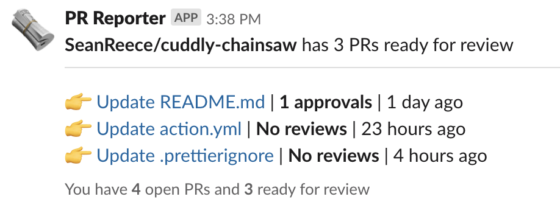

<p align="center">
  <a href="https://github.com/SeanReece/pr-reporter-slack/actions"></a>
</p>

# PR Reporter Slack

A github action that sends you slack messages when you have pull requests ready for review.

<p align="center">
  
</p>

## Usage

### 1. Create Slack webhook
Add a incoming slack webhook by following the directions here: https://api.slack.com/messaging/webhooks#getting-started

PR Reporter will send messages to the slack channel you choose when setting up your webhook.

### 2. Add Slack webhook to github repo secrets
Add a new secret in your repo caled `SLACK_WEBHOOK` and make the value the url of the slack webhook you created earlier.

See: https://help.github.com/en/actions/automating-your-workflow-with-github-actions/creating-and-using-encrypted-secrets#creating-encrypted-secrets

### 3. Create `.github/workflows/pr-reporter-slack.yml`
Copy and paste the following snippet into your .yml file.

```yml
name: PR Reporter

schedule:
    # Run this every day at 9am and 1pm
    - cron:  '0 9,13 * * *'

jobs:
  pr-reporter-slack:
    runs-on: ubuntu-latest
    steps:
    - uses: actions/checkout@v1
    - uses: SeanReece/pr-reporter-slack@v1
      with: 
        repo-token: ${{ secrets.GITHUB_TOKEN }}
        slack-webhook: ${{ secrets.SLACK_WEBHOOK }}
```

